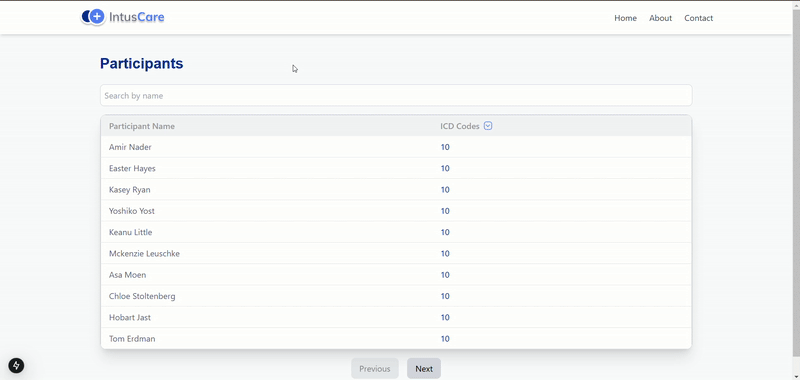

# Intus Care Application Team Code Challenge
# Developer Info

Name: Aditya Sahu (Addy)

University: University of Massachusetts Dartmouth

**Interested in a full-time opportunity with Intus Care.**

# Submission

### Important Assumptions and Comments

+ Participants data is stored under constants/data.ts. While it can be generated using the given API (fakerjs), the IcdCodes count was fixed with the value of 10 and had to tweak the code a little to make it a randomized number.
    ```js
    api/data.js:Line28
    diagnoses: makeDiagnosis(faker.datatype.number({'min':0,'max':10})),
    ```

+ Since the requirements did not specifically mention how to get data, I ran the given API, stored the data in the constants/data.ts file and that was served as the input data. However, as an alternative, an API can also be called instead to fetch the data. 

+ In the given file icdCode.js, some codes are generic so that when given in the input are fetching multiple matched diagnoses. For example, if icdCode input is A15, then it returns a list of all ICD-10-CM codes beginning with "A15". As a consequence of this assumption, the ppt list view page shows the input icdCode count (A15, would be counted as 1) but in the focus mode all the multiple matches returned by the API are shown. Since it was not specifically mentioned how to address this issue, I've taken the liberty to make it so. 

+ The table appears different than the one given in the wireframe. I tried the card-styled but was not going very well with my ppt search feature, so I altered it in such a way that it looks clean and it DOES NOT affect the functionality. I hope it is alright. 

+ I have taken help of AI to optimize styling build on top of the bonus features. However, I can explain each line of code.  

### Deliverables

  * Basic Features
    * Participant list view with ICD code count. ✅
    * Participant focus view with ICD code and condition name list. ✅

  * Bonus Features
    * Sorting filter for Ppt list view: default to sorting highest to lowest, can be toggled to sort from lowest to highest. ✅
    * Made the sorting filter extensible to sort by Partipant name (alphabetical). ✅
    * Search Participants using search term input ✅ 
    * Pagination ✅
    * Favicon Added ✅

### Demo


### Time Taken

* Understand the problem and API docs: 1 hour
* Finalize tech stack: 30 minutes
* Implement the Basic Features: 4 hours
* Implement the Bonus Features: 2 hours


### Approach
1. Firstly I set up next-app using npx create-next-app 
2. Started working on NavBar Component
3. After understanding the wireframe flow and the icdCode API provided by Clinial Table Search Service, I created the table and implemented
4. Implemented sorting feature and other bonus features.
### 

# Running the Project

This is a [Next.js](https://nextjs.org) project bootstrapped with [`create-next-app`](https://nextjs.org/docs/app/api-reference/cli/create-next-app).

1. Ensure that you have all the requirements installed
```bash
npm install
```
2. Run the development server:

```bash
npm run dev
```

Open [http://localhost:3000](http://localhost:3000) with your browser to see the result.

3. If the development build is fine, launch the production build using
```bash
npm run build # to build
npm run start # to launch
```
